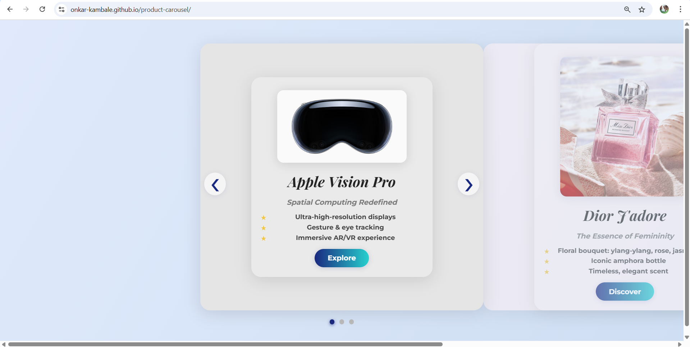
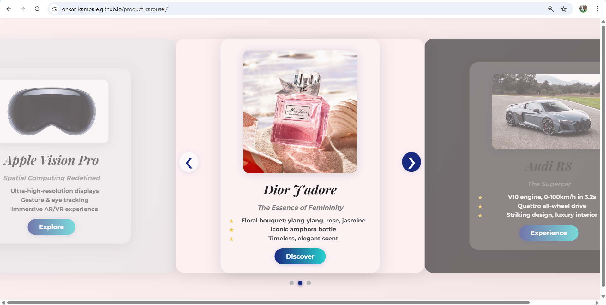

# product-carousel
A responsive, customizable product carousel/slider for showcasing products on your website.

#Overview
This project provides a simple and elegant way to display products in a carousel format, allowing users to browse through multiple items with a smooth sliding animation. It's built with vanilla JavaScript, HTML, and CSS, making it lightweight and easy to integrate into any web project.

#Features
Responsive design that works on all device sizes
Smooth sliding transitions
Customizable navigation controls
Support for product images and information
Easy to implement and customize

## 📸 Preview

